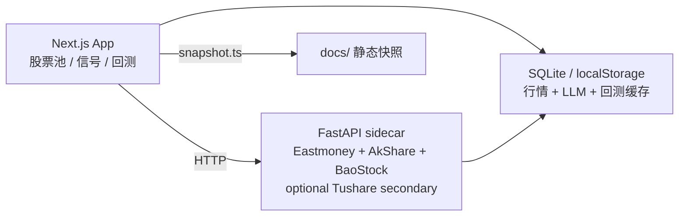

# topkyo · A 股主题研究台（模板）

面向中国 A 股主题研究的**个人研究台模板**，用于维护股票池、查看行情与一致预期参考、生成 LLM 策略信号，并做滚动回测。输出仅供人工复核，**不构成投资建议，不能当作交易指令**。行情来自第三方非官方接口，**默认不是实时成交价**。

> 源自 [madeye/silicon-civilization-stock-trade](https://github.com/madeye/silicon-civilization-stock-trade) fork 后定制。本 fork 增加：组合感知目标仓位、严肃看盘失败语义、Combo A 进阶部署、研究候选排序。默认示例叙事为 AI 基建；操作者可用被 gitignore 的 `web/data/thesis.md` 覆盖。

**仓库分工**

| 仓 | 可见性 | 用途 |
|---|---|---|
| [topkyo/ai-infra-research-template](https://github.com/topkyo/ai-infra-research-template) | public | 对外模板、外部 PR、漏洞报告入口 |
| 维护者私有操作台 | private | 不接受匿名外部报告或外部 PR |

公开模板与维护者操作台可同源。克隆后请复制 `web/data/universe.example.json` 为被忽略的 `web/data/universe.json`，不要把实盘股票池或持仓推进 git。

## 许可

本仓库**没有** `LICENSE` 文件，也**不是** OSI 开源软件。源码公开便于自托管与审阅；版权默认保留。未获书面许可前，请勿将本仓库当作可再分发的开源项目。提交 PR 不授予额外权利，见 [CONTRIBUTING.md](CONTRIBUTING.md)。

## 核心能力

| 能力 | 说明 |
|---|---|
| AI 基建股票池 | 按产业环节维护 A 股主题标的。git 只跟踪 [web/data/universe.example.json](web/data/universe.example.json)；操作者实文件 `web/data/universe.json` 被 gitignore。 |
| 行情与一致预期 | FastAPI sidecar 聚合现价、估值、成长、评级和隐含目标参考。 |
| 组合持仓信号 | 结合真实或模拟持仓生成 5-20 个交易日目标仓位；失败时显式不可用，不合成伪结论。 |
| 严格回测 | 按调仓周期增量重配（避免重复买卖），支持基准指数、单边费率与滑点、涨跌停封板限制（T+1 结构性满足）、信号缓存和结果存档。信号生成与成交均使用**当日收盘价**（close-to-close），不建模盘中路径；对动量类策略可能略偏乐观。**LLM 打分仅使用截至调仓日的价格动量与主题标签**，静态 PE/PB/利润增速等基本面未纳入（无 point-in-time 历史基本面，避免 look-ahead）。 |
| 静态快照 | 输出 `docs/data/*.json`（gitignore）。需要公开展示时由操作者自行用 VPS CLI / 静态托管发布，模板不提供官方公开站。 |

## 产品界面

- `/`：股票池总览，展示主题、现价、一致预期参考、数据来源和刷新入口。仅当配置了 `NEXT_PUBLIC_PUBLIC_SNAPSHOT_URL` 时顶栏才显示「公开快照」；模板默认不链到任何公开站。
- `/signals`：流式生成组合持仓信号，支持真实持仓和模拟资金模式，先展示加载进度，再展示目标仓位、调仓差额或失败原因。
- `/backtest`：策略体检页（全年回测 LLM 消耗高）；配置日期、调仓周期、最大持仓、初始资金、费率、滑点、基准指数和涨跌停限制。
- `docs/`：无需服务端和 API key 的静态快照页面。某操作者把 Combo A 托管到 Vercel 属于自建实例，不是模板官方面。

## 架构



项目结构：

```text
web/       Next.js 15 App Router、API routes、LLM 策略、回测、测试
pyserver/  FastAPI 市场数据 sidecar，免费源优先，Tushare 可选次级源
docs/      静态快照页面与部署说明（数据 JSON 不进 git）
scripts/   本地运维、macOS launchd、Node 原生模块辅助脚本
```

品牌文案集中在 [web/lib/site.ts](web/lib/site.ts)，视觉规范见 [DESIGN.md](DESIGN.md)。

生产部署内置健康检查：docker-compose.yml 与两个 Dockerfile 均定义 healthcheck（pyserver 探 `/health`，web 探 `/`），web 依赖 pyserver 健康后启动。Compose 镜像以非 root 用户 **uid 1001** 运行；`web/data`、`private/` bind mount 与 `web-cache` / `pyserver-cache` 卷权限见 [docs/DEPLOY.md](docs/DEPLOY.md) §3。

## 数据与策略原则

- **免费源优先**：A 股行情与基本面优先使用 Eastmoney / AkShare / BaoStock；Tushare 默认关闭，只在 `MARKET_ENABLE_TUSHARE_SECONDARY=1` 且提供真实 token 时作为补缺源。
- **来源可审计**：sidecar 响应通过 `source`、`warnings`、`field_sources` 暴露字段来源和非实时/缺字段等状态。
- **不伪装实时价**：Eastmoney / 新浪实时 quote 不可用时，可能返回 AkShare `stock_value_em` 或日线最近收盘，并明确标注为非实时参考。
- **LLM 是组合目标源**：规则特征只给 LLM 提供可审计输入，实时信号的目标仓位必须来自 LLM 输出；当前仓位、调仓金额和 `open` / `add` / `hold` / `trim` / `exit` / `watch` 动作由确定性组合规则计算。
- **严格失败语义**：K 线不足、benchmark 缺失、LLM 超时、输出缺失/重复/未知代码、实时信号非法 `targetWeight` 或回测非法 `action` 等硬依赖失败时，API/UI 显式报错，不生成 synthetic hold，不存失败回测结果。
- **股票池刷新不静默成功**：LLM 刷新失败不写文件；LLM 返回空 proposal 可成功返回但不改 `updated_at`；只有真实新增、移除或改类才更新股票池文件。

## LLM 工作流

| 场景 | 路由 / 脚本 | 关键行为 |
|---|---|---|
| 实时信号 | `/api/signals` | POST `mode=real|paper`；真实模式读取本地持仓，LLM 对全池输出目标仓位；按 `SIGNALS_LLM_SCORE_BATCH_SIZE` 串行分批；模型 `LLM_MODEL`；route `maxDuration = 3600`。 |
| 回测 | `/api/backtest` | 每个调仓日对全池打分；`BACKTEST_SIGNAL_CONCURRENCY` 并行调仓日，日内按 `BACKTEST_LLM_SCORE_BATCH_SIZE` 串行分批；route `maxDuration = 3600`。调仓日信号与成交均按**当日收盘价**执行（含首个调仓日），日频 close-to-close，不建模盘中路径；对动量策略可能略偏乐观。**打分输入不含静态基本面**（仅价格动量 + 主题），避免 look-ahead；结果 `warnings` 含中英文说明。 |
| 股票池刷新 | `/api/universe/refresh` | 单次 LLM 审阅整池并提出增删改；`UNIVERSE_REFRESH_LLM_TIMEOUT_MS` 控制提议阶段；route `maxDuration = 900`。 |
| 静态快照 | `web/scripts/snapshot.ts` | 生成股票池、分析师、信号和回测 JSON。**日常公开刷新默认跳过回测**，保留既有 `backtest.json` 并在 meta 标注沿用；策略体检见私有 `/backtest` 或 `SNAPSHOT_INCLUDE_BACKTEST=1`。 |
| 策略体检 | `/backtest` | 全年回测 LLM 消耗高，非每日任务；股票池或策略逻辑有实质变更后再跑。公开页需更新回测时用 `SNAPSHOT_INCLUDE_BACKTEST=1`。 |

LLM 响应按 prompt + model 哈希缓存到 `web/.cache/web.db`，约 12 小时。同参数重复跑信号或回测会复用缓存，但缓存命中不改变严格校验规则。

**花费档位**（日常 / 研究日 / 策略体检）与 VPS 一键命令见 [docs/OPERATIONS.md](docs/OPERATIONS.md)「静态快照 → 花费档位」。

**私有台每日（研究日，`:3000`）**：首页看盘 → 按需刷新股票池 → `/signals` 持仓信号；不要每日跑全年回测。公开站另用 VPS 一键更新。流程见 [docs/RESEARCH_WORKFLOW.md](docs/RESEARCH_WORKFLOW.md)。

完整变量表和调优建议见 [docs/OPERATIONS.md](docs/OPERATIONS.md)。

## 真实持仓

`/signals` 默认使用真实持仓模式。首次使用时可在页面粘贴券商持仓表，Web 会通过 `/api/holdings` 写入本地文件 `web/data/holdings.local.json`。该文件被 `.gitignore` 忽略，不应提交；示例结构见 [web/data/holdings.example.json](web/data/holdings.example.json)。

持仓文件只接受股票池内标的、正持仓数量、非负现金和非负成本价。文件缺失或非法时，`/api/signals` 会先返回 `setup_required`，不会继续请求行情或 LLM。模拟资金模式使用页面输入的现金做目标仓位推演，不代表真实持仓。

## 本地启动

默认只绑 loopback。不要把 `docker-compose.yml` 改成 `0.0.0.0` 或 `-p 3000:3000` 暴露到公网网卡，否则会直接暴露无应用层鉴权的 API（见 [SECURITY.md](SECURITY.md)）。

### 0. 准备股票池

```bash
cp web/data/universe.example.json web/data/universe.json
# 可选：cp web/data/thesis.example.md web/data/thesis.md 后修改叙事
```

### 1. 启动 pyserver

```bash
cd pyserver
cp env.example .env
# 免费真实数据无需 Tushare token；如需 Tushare 补缺，再设置 TUSHARE_TOKEN 和 MARKET_ENABLE_TUSHARE_SECONDARY=1
uv sync
uv run uvicorn main:app --host 127.0.0.1 --port 8001 --reload
```

### 2. 启动 Web

Node 版本由仓库根目录 [`.nvmrc`](.nvmrc) 锁定。`better-sqlite3` 是原生模块，必须与运行时 Node 主版本一致，否则 `/api/signals` 等路由可能 HTTP 500。

推荐一次性配置 direnv，让进入仓库时自动 `nvm use`：

```bash
./scripts/setup-direnv.sh
```

手动启动：

```bash
nvm install
nvm use
cd web
npm install
cp env.example.txt .env.local
# 配置 LLM_PROVIDER=deepseek 与 DEEPSEEK_API_KEY（或 opencode-go）
npm run dev
```

打开 <http://localhost:3000>。

## 常用命令

| 目的 | 命令 |
|---|---|
| Web 单元测试 | `cd web && npm test` |
| Web 类型检查 | `cd web && ./node_modules/.bin/tsc --noEmit` |
| E2E 冒烟测试 | `cd web && npm run test:e2e`（自动起 mock pyserver + dev server） |
| pyserver 单元测试 | `cd pyserver && uv run python -m unittest discover -p "test_*.py"` |
| 生产构建 | `cd web && npm run build` |
| 刷新股票池 | `cd web && npx tsx scripts/refresh-universe.ts` |
| 生成静态快照（日常，跳过回测） | `cd web && SNAPSHOT_SKIP_BACKTEST=1 npx tsx scripts/snapshot.ts` |
| VPS 公开一键（日常，默认无回测） | `./scripts/vps-refresh-public-snapshot.sh` |
| VPS 策略体检（含回测写回公开页） | `SNAPSHOT_INCLUDE_BACKTEST=1 ./scripts/vps-refresh-public-snapshot.sh` |
| 本地监控日志 | `./scripts/monitor-dashboard.sh` → `tail -f .monitor/logs/current.log` |
| 本地预览静态页 | `python3 -m http.server 8765 --directory docs` |

不要在同一工作区同时运行 `npm run dev` 和 `npm run build`。

## 文档导航

| 文档 | 用途 |
|---|---|
| [docs/RESEARCH_WORKFLOW.md](docs/RESEARCH_WORKFLOW.md) | AI 基建一级过滤、5-6 只候选深挖、LLM/炼丹炉二级讨论流程。 |
| [docs/OPERATIONS.md](docs/OPERATIONS.md) | 本地运行、环境变量、缓存、LLM 调优、本机/VPS/GitHub 对齐、常用排障。 |
| [docs/DEPLOY.md](docs/DEPLOY.md) | 生产部署：默认本机自托管；组合 A 为进阶可选（VPS 私有 Docker Compose + Caddy，Vercel 公开 `docs/` 快照）。 |
| [docs/COMBO_A_RUNBOOK.md](docs/COMBO_A_RUNBOOK.md) | 组合 A 上机勾选清单（DNS、防火墙、Compose、Caddy、Vercel、验收）。 |
| [docs/README.md](docs/README.md) | 静态快照说明（自行托管；Vercel / GitHub Pages / 本机预览）。 |
| [docs/specs](docs/specs)、[docs/plans](docs/plans) | 已落地变更的历史记录，不代表当前推荐默认路径。 |
| [pyserver/README.md](pyserver/README.md) | 市场数据 sidecar、端点、数据源优先级和响应元数据。 |
| [scripts/macos/README.md](scripts/macos/README.md) | macOS launchd 本地系统服务。 |
| [docs/TUSHARE-PERMISSIONS.md](docs/TUSHARE-PERMISSIONS.md) | Tushare 次级源权限参考。 |

## 安全

- 不提交 `.env`、`.env.local`、`cache.db`、API key。
- 不提交 `web/data/holdings.local.json`、`web/data/universe.json`、`web/data/thesis.md`；前两者可能含真实持仓与观察名单。
- LLM key 只放在 `web/.env.local` 或部署环境变量。
- Tushare token 只放在 `pyserver/.env` 或部署环境变量。
- `docs/data/*.json` 是公开静态快照（不进 git），包含研究输出；只通过 VPS CLI 部署，勿当私有持仓备份。
